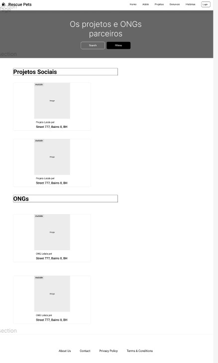

<<<<<<< HEAD:docs/02 - relatório técnico/Relatorio Tecnico - TEMPLATE.md
# Informações do Projeto
`TÍTULO DO PROJETO`  

 Resgate Pet 

`CURSO` 

 Sistema de informação 

## Participantes

> Os membros do grupo são: 
> - Luiz Roberto Pimentel
> - Ricardo Alves Coelho
> - Daniel filipy da Silva 
> - Madson
> - Samuel Valadão 

# Estrutura do Documento

- [Informações do Projeto](#informações-do-projeto)
  - [Participantes](#participantes)
- [Estrutura do Documento](#estrutura-do-documento)
- [Introdução](#introdução)
  - [Problema](#problema)
  - [Objetivos](#objetivos)
  - [Justificativa](#justificativa)
  - [Público-Alvo](#público-alvo)
- [Especificações do Projeto](#especificações-do-projeto)
  - [Personas e Mapas de Empatia](#personas-e-mapas-de-empatia)
  - [Histórias de Usuários](#histórias-de-usuários)
  - [Requisitos](#requisitos)
    - [Requisitos Funcionais](#requisitos-funcionais)
    - [Requisitos não Funcionais](#requisitos-não-funcionais)
  - [Restrições](#restrições)
- [Projeto de Interface](#projeto-de-interface)
  - [User Flow](#user-flow)
  - [Wireframes](#wireframes)
- [Metodologia](#metodologia)
  - [Divisão de Papéis](#divisão-de-papéis)
  - [Ferramentas](#ferramentas)
  - [Controle de Versão](#controle-de-versão)
- [**############## SPRINT 1 ACABA AQUI #############**](#-sprint-1-acaba-aqui-)
- [Projeto da Solução](#projeto-da-solução)
  - [Tecnologias Utilizadas](#tecnologias-utilizadas)
  - [Arquitetura da solução](#arquitetura-da-solução)
- [Avaliação da Aplicação](#avaliação-da-aplicação)
  - [Plano de Testes](#plano-de-testes)
  - [Ferramentas de Testes (Opcional)](#ferramentas-de-testes-opcional)
  - [Registros de Testes](#registros-de-testes)
- [Referências](#referências)

# Introdução
O projeto "ResgatePet" é o resultado de nossa profunda paixão e compromisso com uma causa que nos toca profundamente: o bem-estar dos animais de estimação. Num mundo onde inúmeros animais são frequentemente abandonados, sujeitos a maus-tratos e negligência, acreditamos firmemente que é nosso dever fazer a diferença. O propósito deste site é criar um ambiente facilitador para a adoção responsável de animais de estimação, construindo um espaço onde entusiastas e amantes dos animais possam se unir em prol do resgate, cuidado e busca de lares amorosos para aqueles que mais necessitam.

## Problema

O problema que estamos dedicados a resolver é a triste realidade de uma população crescente de animais de estimação que são cruelmente abandonados ou submetidos a maus-tratos, além da lamentável falta de recursos eficazes para resgatá-los e encontrar para eles novos lares amorosos. Essa situação é profundamente alarmante, pois inúmeros animais sofrem diariamente com a ausência de cuidados adequados e dignos, enquanto aqueles dispostos a adotar animais resgatados muitas vezes se deparam com desafios e obstáculos que dificultam a concretização desse ato compassivo.
A crescente população de animais abandonados é um dilema que não pode ser ignorado, pois impacta negativamente não apenas a vida dos próprios animais, mas também a sociedade como um todo. Animais negligenciados enfrentam sofrimento, fome e, em muitos casos, doenças evitáveis devido à falta de cuidados básicos. Além disso, comunidades são afetadas pelo aumento de animais de rua, causando preocupações de saúde pública e impactando a qualidade de vida de todos os envolvidos.

## Objetivos
O objetivo central do nosso projeto é estabelecer um espaço dedicado e abrangente para a promoção do bem-estar dos animais de estimação, o que se desdobra em um conjunto de metas fundamentais que abraçamos com paixão e determinação:

Facilitação da Adoção Responsável: Colocamos como nossa missão primordial simplificar e incentivar a adoção responsável de animais de estimação.

Canal Seguro para Denúncias: Reconhecemos a crucial importância da ação imediata na proteção dos animais em situações de perigo.

Hospedagem Temporária e Cuidados Adequados: Uma faceta essencial de nossa iniciativa é a criação de um espaço de hospedagem temporária para animais em situações de risco. Aqui, eles receberão os cuidados apropriados e necessários enquanto aguardam a oportunidade de encontrar um lar permanente.

Central de Doações para a Causa: Estamos firmemente empenhados em atuar como um ponto central para doações destinadas a organizações não governamentais (ONGs) veterinárias e indivíduos engajados na proteção e no bem-estar dos animais.

## Justificativa
A base fundamental para a concepção deste projeto reside na urgente necessidade de aprimorar a qualidade de vida dos animais de estimação que enfrentam situações de extrema precariedade, ao mesmo tempo em que buscamos educar e conscientizar a comunidade sobre questões relacionadas ao bem-estar animal. Acreditamos firmemente que, ao facilitar o resgate e a adoção responsável, podemos não apenas reduzir significativamente o sofrimento dos animais, mas também construir uma comunidade mais inclusiva, participativa e engajada na causa.

## Público-Alvo
Nosso alcance se estende a uma ampla gama de indivíduos e grupos, abraçando um público diversificado e engajado que compreende:

Potenciais Adotantes de Animais de Estimação: Este grupo representa aqueles que aspiram a encontrar um fiel companheiro e estão genuinamente interessados em adotar um animal resgatado.

Voluntários Dedicados: Os voluntários são a espinha dorsal de nossa iniciativa. Eles são indivíduos altruístas que desejam doar seu tempo, energia e recursos para o resgate, reabilitação e cuidado contínuo dos animais.

Doadores Generosos: A generosidade financeira desses indivíduos e organizações é um pilar essencial para o sucesso de nossas operações de resgate e o bem-estar dos animais sob nossa tutela.

Amantes de Animais em Geral: Este segmento do nosso público é composto por aqueles que, mesmo que não estejam em busca de adoção, compartilham um amor profundo e sincero por animais.

# Especificações do Projeto
O projeto "ResgatePet" surge da paixão e dedicação ao bem-estar dos animais de estimação, visando abordar problemas como o abandono e maus-tratos a esses animais. O principal objetivo do projeto é criar um ambiente que facilite a adoção responsável de animais, oferecendo um espaço para conectá-los com pessoas interessadas em proporcionar-lhes um lar amoroso. Além disso, busca-se estabelecer um canal seguro para denúncias de maus-tratos e abandono de animais, reconhecendo a importância da ação imediata para proteger os animais em perigo.

## Personas e Mapas de Empatia

## Histórias de Usuários

Com base na análise das personas forma identificadas as seguintes histórias de usuários:

|EU COMO... `PERSONA`| QUERO/PRECISO ... `FUNCIONALIDADE` |PARA ... `MOTIVO/VALOR`                 |
|--------------------|------------------------------------|----------------------------------------|
|Maria Teresa        | Deseja adotar um animal de estimação para que seus filhos aprendam sobre responsabilidade e compaixão. Ela procura um site que facilite a adoção e ofereça informações sobre como cuidar de um animal em casa.           | Está preocupada com a segurança de seus filhos e quer um local confiável para denunciar qualquer situação de abandono ou maus-tratos que eles possam testemunhar.            |
|Patrícia Neves       | Deseja se voluntariar em ONGs que cuidam de animais e buscar um site que liste oportunidades de trabalho voluntário. Ele é apaixonado por cuidar de animais e quer adquirir experiência prática em sua área de estudo.               | Está interessado em denunciar casos de maus tratos e abandono de animais quando os encontra, e o site oferece um canal seguro para isso. |
|Glenda Ribeiro     | Encontrar um novo companheiro de quatro patas para sua casa. Ela busca um site que facilite a adoção responsável de animais, pois acredita firmemente na importância de dar um lar amoroso aos animais em necessidade.                 | Quer aprender mais sobre os cuidados ideais para seu futuro animal de estimação, e acredita que os vlogs de cuidados oferecidos pelo site ajudam a se tornar uma dona responsável. |
|Luciano Augusto     |Deseja se manter ocupado após sua aposentadoria e contribuir para uma causa significativa. Ele quer encontrar ONGs, locais de proteção aos animais para oferecer seu tempo como voluntário e apoiar financeiramente essas organizações.                | Acredita que seu conhecimento sobre cuidados com animais pode ser valioso e quer ser útil para outras pessoas por meio de vlogs educativos no site. |
## Requisitos

As tabelas que se seguem apresentam os requisitos funcionais e não funcionais que detalham o escopo do projeto.

### Requisitos Funcionais

### Requisitos não Funcionais

|ID     | Descrição do Requisito  |Prioridade |
|-------|-------------------------|----|
|RNF-01| O site deve ser publicado em um ambiente acessível publicamente na Internet (Repl.it, GitHub Pages, Heroku); | ALTA | 
|RNF-02| O site deverá ser responsivo permitindo a visualização em um celular de forma adequada |  ALTA | 
|RNF-03| O site deve ter bom nível de contraste entre os elementos da tela em conformidade |  MÉDIA | 

## Restrições

O projeto está restrito pelos itens apresentados na tabela a seguir.

|ID| Restrição                                             |
|--|-------------------------------------------------------|
|01| O projeto deverá ser entregue até o final do semestre |
|02| O aplicativo deve se restringir às tecnologias básicas da Web no Frontend   |
|03| A equipe não pode subcontratar o desenvolvimento do trabalho.|

# Projeto de Interface

.O nosso protótipo interativo está disponível para acesso através do seguinte link: https://marvelapp.com/prototype/100jd35a  . Para uma experiência prática e visual do estado atual, confira a imagem abaixo.

## User Flow
Fluxo do usuário
O diagrama apresentado na Figura mostra o fluxo de interação do usuário pelas telas do sistema. Cada uma das telas deste fluxo é detalhada na seção de WireFrames que se segue. Para visualizar o WireFrame interativo, acesse o link: 
https://marvelapp.com/prototype/100jd35a/screens

## Wireframes

Página inicial

Pagina adoção

Informação de Adoção

Pagina Projeto

Pagina histórias

Pagina sobre

Pagina de cadastro

Pagina login

Pagina Perfil

Pagina Recuperar senha

# Metodologia
A equipe utiliza metodologias ágeis, tendo escolhido o Scrum como base para definição do processo de desenvolvimento.

## Divisão de Papéis

A equipe está organizada da seguinte maneira:

  ●	Scrum Master: Ricardo Alves Coelho

  ●	Product Owner: Luiz Roberto Pimentel

●	Equipe de Desenvolvimento

    ●	Samuel Valadão (Desenvolvedor Front End)

    ●	Madson (Desenvolvedor Back End)

    ●	Ricardo Alves Coelho (Analista de Negócios)

    ●	Luiz Roberto Pimentel (Desenvolvedor Front End)

    ●	Daniel filipy da Silva Moreira (Designer)

Para organização e distribuição das tarefas do projeto, a equipe está utilizando o Trello estruturado com as seguintes listas:

  ●	Recursos: esta lista mantém um template de tarefas recorrentes com as configurações padronizadas que todos devem seguir. O objetivo é permitir a cópia destes templates para agilizar a criação de novos cartões.

  ●	Backlog: recebe as tarefas a serem trabalhadas e representa o Product Backlog. Todas as atividades identificadas no decorrer do projeto também devem ser incorporadas a esta lista.

  ●	To Do: Esta lista representa o Sprint Backlog. Este é o Sprint atual que estamos trabalhando.

  ●	Doing: Quando uma tarefa tiver sido iniciada, ela é movida para cá.

  ●	Test: Checagem de Qualidade. Quando as tarefas são concluídas, eles são movidos para o “CQ”. No final da semana, eu revejo essa lista para garantir que tudo saiu perfeito.

  ●	Done: nesta lista são colocadas as tarefas que passaram pelos testes e controle de qualidade e estão prontos para ser entregues ao usuário. Não há mais edições ou revisões necessárias, ele está agendado e pronto para a ação.

  ●	Locked: Quando alguma coisa impede a conclusão da tarefa, ela é movida para esta lista juntamente com um comentário sobre o que está travando a tarefa.

## Ferramentas

| Ambiente  | Plataforma              |Link de Acesso |
|-----------|-------------------------|---------------|
|Repositório de código | GitHub | https://github.com/ICEI-PUC-Minas-PPLCC-TI/ti-1-ppl-cc-m-20231-resgatepet| 
|Protótipo Interativo | MavelApp ou Figma | https://marvelapp.com/prototype/100jd35a | 

## Controle de Versão

Após obter um erro durante a realização do projeto, a versão estável e testada foi trocada de nome, substituindo o ramo "master". Conforme a familiaridade com o software aumenta, novas vertentes de diferentes versões serão desenvolvidas, a fim de selecionar as tendências mais eficazes.

# **############## SPRINT 1 ACABA AQUI #############**

# Projeto da Solução

Um layout amigável e atraente com imagens de animais de estimação.
Destaques para promoções, eventos ou notícias relacionadas a animais.
Cadastro de Usuário:
Permitir que os usuários se cadastrem para criar perfis para seus animais de estimação.
Armazenar informações como nome, idade, raça, e necessidades especiais dos animais.
Adoção de Animais:
Uma seção dedicada para adoção de animais.
Informações sobre animais disponíveis para adoção, incluindo fotos, histórico médico, etc.
Fórum ou Comunidade:
Um espaço onde os amantes de animais podem interagir, compartilhar dicas e fazer perguntas.
Moderadores para garantir um ambiente seguro e respeitoso.
Serviços Veterinários Online:
Consultas veterinárias online ou agendamento de consultas presenciais.
Upload de registros médicos dos animais para facilitar as consultas.

Seção de Dicas e Artigos:
Conteúdo educacional sobre cuidados com animais de estimação, treinamento, saúde, etc.
Integração com Redes Sociais:
Facilitar o compartilhamento de fotos, histórias e informações sobre animais de estimação nas redes sociais.

## Tecnologias Utilizadas

Desenvolvimento Front-end:
Linguagens: HTML, CSS, JavaScript
Framework: Bootstrap
Descrição: Para o desenvolvimento da parte frontal do site, utilizamos HTML, CSS e JavaScript, aproveitando a praticidade e eficiência do framework Bootstrap. Isso resultou em uma interface responsiva e amigável, garantindo uma experiência consistente em diferentes dispositivos.
Desenvolvimento Back-end:
Descrição: Não foi realizado nenhum desenvolvimento back-end neste projeto. O site foi estruturado como uma aplicação estática, sem a necessidade de processamento server-side. Essa abordagem foi escolhida com base nos requisitos do projeto e na simplicidade desejada.
Ferramentas: Git, GitHub
Descrição: Utilizamos o Git como sistema de controle de versão, integrado ao GitHub para o armazenamento e colaboração eficiente no código-fonte. Isso permitiu um acompanhamento detalhado das mudanças, facilitando a colaboração entre os membros da equipe e garantindo a integridade do código.

## Plano de Testes

Testes:
Método: Testes Manuais
Descrição: A verificação da qualidade do site foi realizada por meio de testes manuais, abrangendo diferentes cenários de uso. Isso incluiu testes de funcionalidade, usabilidade e compatibilidade com navegadores, assegurando que o site atendesse aos requisitos estabelecidos.

# Referências

A lista a seguir traz as referências utilizadas nesse trabalho. são elas: 
Littlefield, A. Guia da metodologia ágil e scrum para iniciantes. 2016. Disponível em: https://blog.trello.com/br/scrum-metodologia-agil. Acessado em 26/05/2020.
Periferia em Movimento. "Animais de Rua: Uma Abordagem da Periferia". Disponível em: https://periferiaemmovimento.com.br/animaisderua/ . Acessado em 20/09/2023.
PetAnjo. “Pare de Abandonar: Conscientização sobre o Abandono de Animais”. Disponível em: https://petanjo.com/blog/paredeabandonar-conscientizacao-sobre-abandono-de-animais/ . Acessado em 20/09/2023.

